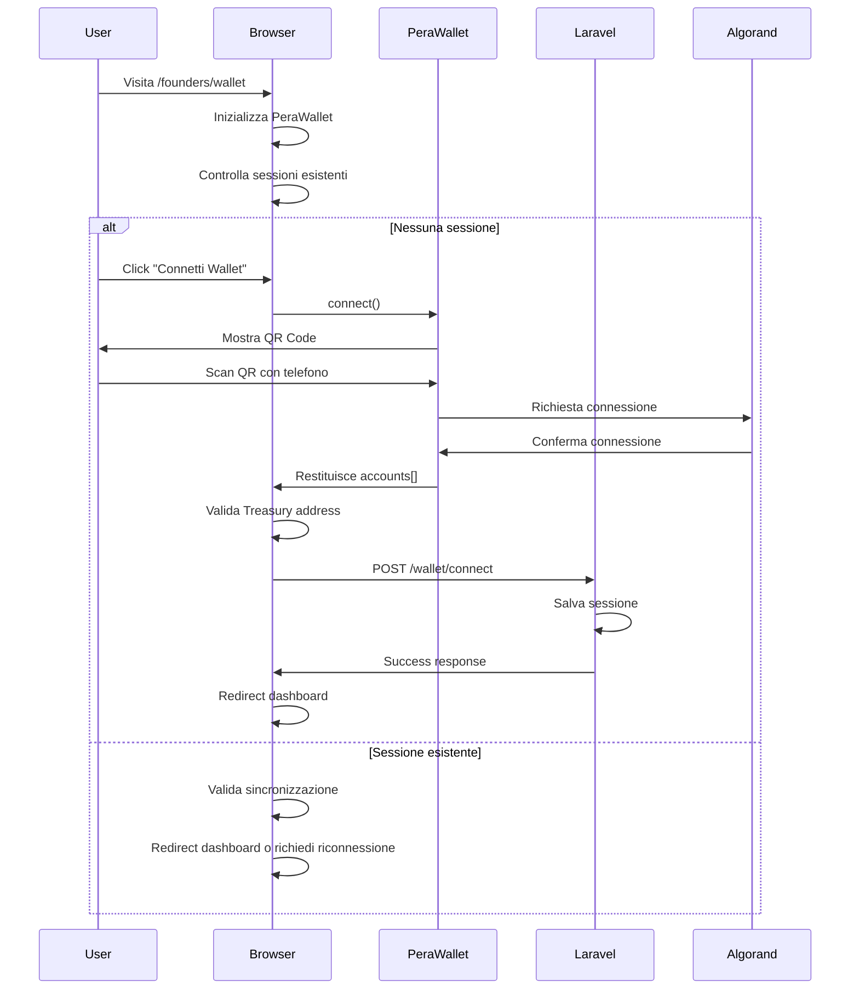
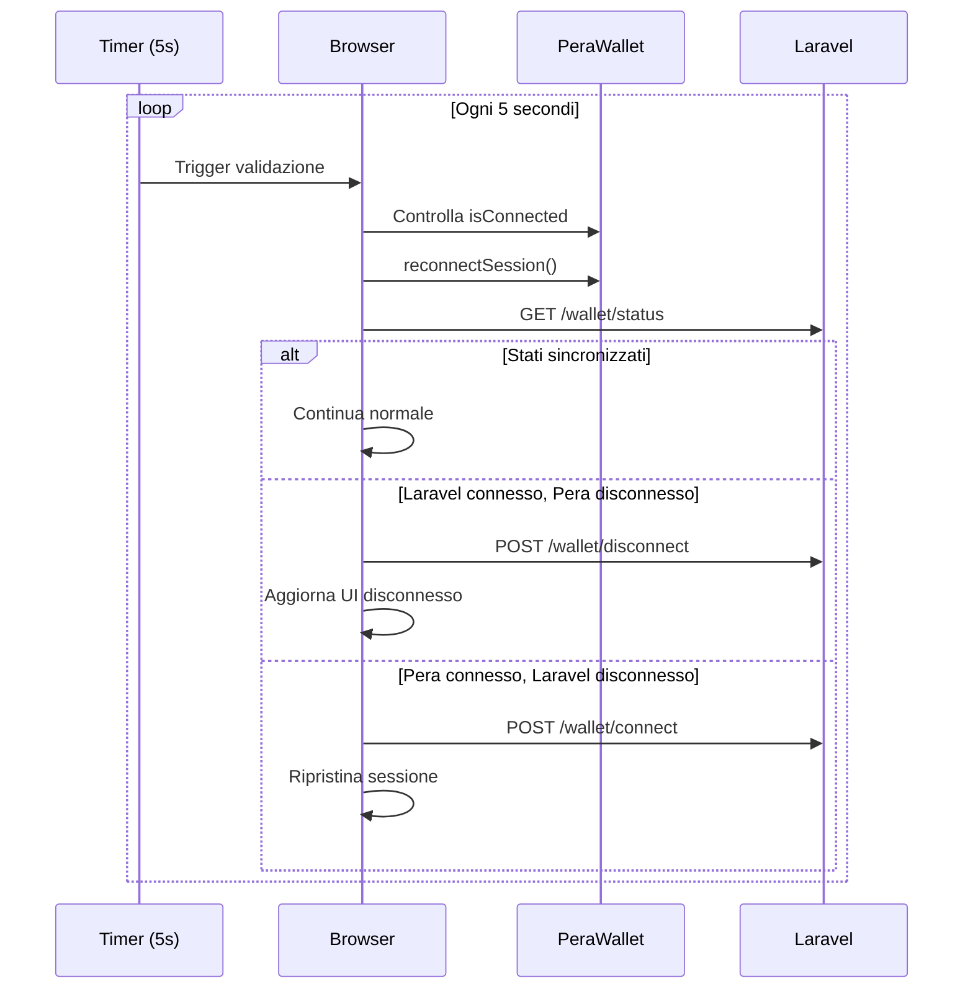
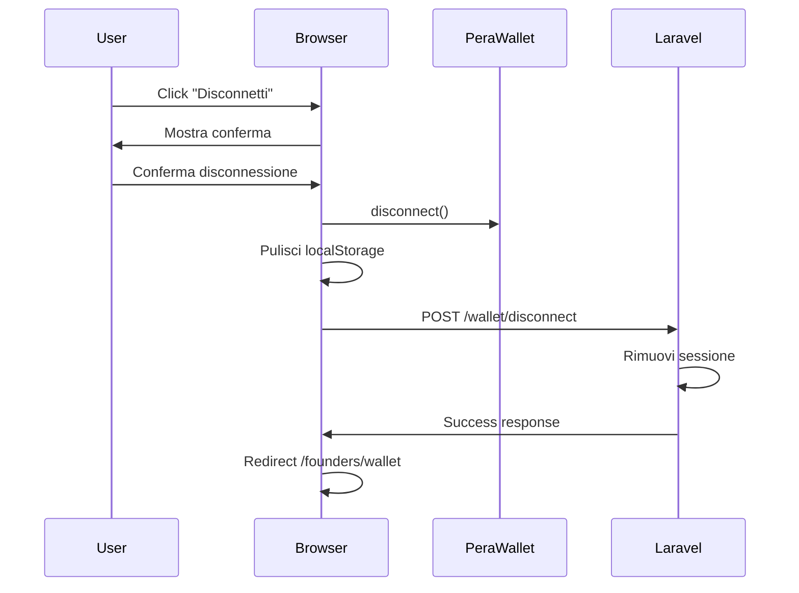

# Integrazione PeraWallet per Sistema Autenticazione Blockchain

## Abstract

Il **FlorenceEGI Founders System** implementa un sistema di autenticazione basato su wallet Algorand utilizzando **PeraWallet** per la gestione dei "Padri Fondatori" certificates. Il sistema richiede che solo il **Treasury wallet** possa accedere alle funzionalità di gestione, garantendo sicurezza e controllo centralizzato.

L'integrazione presenta sfide tecniche significative legate alla sincronizzazione bidirezionale tra PeraWallet (mobile) e Laravel (backend), alla gestione delle sessioni cross-platform, e ai requisiti HTTPS per la compatibilità wallet.

## Scopo del Sistema

### Obiettivi Principali

-   **Autenticazione Blockchain**: Utilizzare wallet Algorand invece di credenziali tradizionali
-   **Controllo Accesso**: Solo il Treasury wallet può accedere al sistema di gestione
-   **Gestione Certificates**: Amministrazione centralizzata dei certificati "Padri Fondatori"
-   **Sicurezza**: Eliminare password e credenziali tradizionali vulnerabili

### Benefici

-   **Sicurezza Superiore**: Autenticazione crittografica invece di password
-   **Controllo Granulare**: Accesso limitato a wallet specifici
-   **Tracciabilità**: Tutte le azioni sono associate a indirizzi wallet
-   **User Experience**: Connessione rapida tramite QR code mobile

## Problemi Incontrati e Sfide Superate

### 1. Requisiti HTTPS Obbligatori

**Problema**: PeraWallet richiede HTTPS anche in ambiente di sviluppo locale per motivi di sicurezza.

**Soluzione Implementata**:

```bash
# Installazione mkcert per certificati SSL locali
brew install mkcert  # macOS
# oppure
apt install mkcert   # Ubuntu/Debian

# Generazione certificati per localhost
mkcert -install
mkcert localhost 127.0.0.1 ::1

# Configurazione nginx proxy per HTTPS:8443
server {
    listen 8443 ssl;
    server_name localhost;
    ssl_certificate /path/to/localhost.pem;
    ssl_certificate_key /path/to/localhost-key.pem;
    location / {
        proxy_pass http://localhost:9000;
    }
}
```

**Configurazione Laravel**:

```php
// config/app.php
'url' => env('APP_URL', 'https://localhost:8443'),

// .env
APP_URL=https://localhost:8443
```

### 2. Sincronizzazione Bidirezionale PeraWallet ↔ Laravel

**Problema**: PeraWallet (mobile) e Laravel (backend) mantengono sessioni separate che possono desincronizzarsi.

**Sfide Specifiche**:

-   Disconnessione dal telefono non rilevata dal browser
-   Sessioni Laravel persistenti dopo disconnessione wallet
-   Timing di connessione variabile (QR code scan)
-   Rilevamento automatico completamento connessione

**Soluzione Implementata**:

```javascript
// Controllo sincronizzazione periodico ogni 5 secondi
function startSyncCheck() {
    syncCheckInterval = setInterval(async () => {
        await validateWalletSync();
    }, WALLET_CONFIG.SYNC_CHECK_INTERVAL);
}

// Validazione incrociata stati
async function validateWalletSync() {
    const laravelSession = await checkLaravelSession();
    const peraConnected = peraWallet?.isConnected;
    const peraAccounts = peraWallet ? await peraWallet.reconnectSession() : [];

    // Logica di sincronizzazione
    if (
        laravelSession.connected &&
        (!peraConnected || peraAccounts.length === 0)
    ) {
        // Laravel connesso ma PeraWallet disconnesso → Pulisci tutto
        await clearWalletSession();
        handleWalletDisconnected();
    }
}
```

### 3. Gestione Timeout e Retry Logic

**Problema**: Connessioni PeraWallet possono fallire o avere ritardi imprevedibili.

**Soluzione**:

```javascript
// Retry automatico con backoff
async function connectWithRetry() {
    for (let attempt = 1; attempt <= WALLET_CONFIG.RETRY_ATTEMPTS; attempt++) {
        try {
            const accounts = await peraWallet.connect();
            if (accounts.length > 0) return accounts;
        } catch (error) {
            if (attempt === WALLET_CONFIG.RETRY_ATTEMPTS) throw error;
            await new Promise((resolve) =>
                setTimeout(resolve, WALLET_CONFIG.RETRY_DELAY * attempt)
            );
        }
    }
}

// Polling intelligente per rilevamento connessione
function startConnectionPolling() {
    let attempts = 0;
    const maxAttempts = WALLET_CONFIG.MAX_POLLING_ATTEMPTS;

    const pollInterval = setInterval(async () => {
        attempts++;
        const connected = await checkConnectionStatus();

        if (connected || attempts >= maxAttempts) {
            clearInterval(pollInterval);
            if (connected) handleConnectionSuccess();
        }
    }, WALLET_CONFIG.POLLING_INTERVAL);
}
```

### 4. Gestione URL e Redirect

**Problema**: Redirect tra HTTP/HTTPS e porte diverse causava errori di connessione.

**Soluzione**:

```javascript
// Generazione URL consistente
function generateSecureUrl(path) {
    const currentUrl = window.location.href;
    let baseUrl;

    if (currentUrl.includes('localhost:8443')) {
        baseUrl = 'https://localhost:8443';
    } else {
        baseUrl = 'https://localhost:8443';
    }

    return `${baseUrl}${path}`;
}

// Middleware Laravel per redirect HTTPS
class WalletAuthMiddleware {
    public function handle($request, Closure $next) {
        // Forza HTTPS:8443 per compatibilità PeraWallet
        if (!$request->secure() || $request->getPort() !== 8443) {
            return redirect()->secure($request->getRequestUri(), 301);
        }

        $walletAddress = session('wallet_address');
        $treasuryWallet = config('founders.algorand.treasury_address');

        if ($walletAddress !== $treasuryWallet) {
            return redirect()->route('founders.wallet.connect');
        }

        return $next($request);
    }
}
```

### 5. Event Handling e State Management

**Problema**: Gestione eventi complessa tra PeraWallet, DOM e Laravel.

**Soluzione**:

```javascript
// Event listeners centralizzati
function setupEventListeners() {
    // Rilevamento disconnessione PeraWallet
    peraWallet.connector?.on("disconnect", () => {
        console.log("🔌 PeraWallet disconnesso via evento");
        handleWalletDisconnected();
    });

    // Gestione visibilità pagina
    document.addEventListener("visibilitychange", () => {
        if (!document.hidden) {
            validateWalletSync();
        }
    });

    // Gestione beforeunload
    window.addEventListener("beforeunload", () => {
        if (syncCheckInterval) {
            clearInterval(syncCheckInterval);
        }
    });
}
```

## Setup Tecnico Richiesto

### Prerequisiti Sistema

1. **mkcert per Certificati SSL**:

```bash
# Installazione
brew install mkcert  # macOS
apt install mkcert   # Ubuntu/Debian
winget install FiloSottile.mkcert  # Windows

# Setup certificati
mkcert -install
mkcert localhost 127.0.0.1 ::1
```

2. **Nginx Proxy per HTTPS:8443**:

```nginx
server {
    listen 8443 ssl;
    server_name localhost;

    ssl_certificate /path/to/localhost.pem;
    ssl_certificate_key /path/to/localhost-key.pem;

    location / {
        proxy_pass http://localhost:9000;
        proxy_set_header Host $host;
        proxy_set_header X-Real-IP $remote_addr;
        proxy_set_header X-Forwarded-For $proxy_add_x_forwarded_for;
        proxy_set_header X-Forwarded-Proto $scheme;
    }
}
```

3. **Configurazione Laravel**:

```php
// config/founders.php
return [
    'algorand' => [
        'treasury_address' => env('ALGORAND_TREASURY_ADDRESS', 'YOUR_TREASURY_ADDRESS'),
        'network' => env('ALGORAND_NETWORK', 'testnet'),
    ],
];

// .env
APP_URL=https://localhost:8443
ALGORAND_TREASURY_ADDRESS=YOUR_TREASURY_WALLET_ADDRESS
ALGORAND_NETWORK=testnet
```

### Dipendenze Frontend

```json
{
    "dependencies": {
        "@perawallet/connect": "^1.3.4",
        "@vitejs/plugin-laravel": "^0.8.0"
    }
}
```

```javascript
// vite.config.js
import { defineConfig } from "vite";
import laravel from "@vitejs/plugin-laravel";

export default defineConfig({
    plugins: [
        laravel({
            input: ["resources/js/founder-certificate-wallet.js"],
            refresh: true,
        }),
    ],
    server: {
        https: true,
        port: 5173,
    },
});
```

## Flusso di Funzionamento

### 1. Connessione Wallet



### 2. Controllo Sincronizzazione



### 3. Disconnessione



## Aspetti Tecnici

### Architettura Componenti

```
┌─────────────────┐    ┌──────────────────┐    ┌─────────────────┐
│   PeraWallet    │    │   JavaScript     │    │     Laravel     │
│   (Mobile)      │◄──►│   Frontend       │◄──►│    Backend      │
│                 │    │                  │    │                 │
│ • QR Code       │    │ • State Mgmt     │    │ • Session Mgmt  │
│ • Signing       │    │ • Sync Logic     │    │ • Validation    │
│ • Disconnect    │    │ • Event Handling │    │ • Middleware    │
└─────────────────┘    └──────────────────┘    └─────────────────┘
```

### Gestione Stati

```javascript
// Stati possibili del sistema
const WalletStates = {
    DISCONNECTED: "disconnected",
    CONNECTING: "connecting",
    CONNECTED: "connected",
    SYNCING: "syncing",
    ERROR: "error",
};

// Transizioni di stato
const StateTransitions = {
    [WalletStates.DISCONNECTED]: [WalletStates.CONNECTING],
    [WalletStates.CONNECTING]: [WalletStates.CONNECTED, WalletStates.ERROR],
    [WalletStates.CONNECTED]: [WalletStates.SYNCING, WalletStates.DISCONNECTED],
    [WalletStates.SYNCING]: [WalletStates.CONNECTED, WalletStates.DISCONNECTED],
    [WalletStates.ERROR]: [WalletStates.DISCONNECTED, WalletStates.CONNECTING],
};
```

### Configurazione Sicurezza

```php
// Middleware WalletAuth
class WalletAuthMiddleware
{
    public function handle($request, Closure $next)
    {
        // 1. Forza HTTPS:8443
        if (!$request->secure() || $request->getPort() !== 8443) {
            return redirect()->secure($request->getRequestUri(), 301);
        }

        // 2. Verifica sessione wallet
        $walletAddress = session('wallet_address');
        if (!$walletAddress) {
            return redirect()->route('founders.wallet.connect');
        }

        // 3. Valida Treasury address
        $treasuryWallet = config('founders.algorand.treasury_address');
        if ($walletAddress !== $treasuryWallet) {
            session()->forget('wallet_address');
            return redirect()->route('founders.wallet.connect')
                ->with('error', 'Solo il Treasury wallet può accedere');
        }

        return $next($request);
    }
}
```

### API Endpoints

```php
// Route wallet management
Route::prefix('founders/wallet')->group(function () {
    // GET /founders/wallet/status - Stato sessione
    Route::get('/status', function () {
        return response()->json([
            'connected' => session('wallet_address') === config('founders.algorand.treasury_address'),
            'address' => session('wallet_address')
        ]);
    });

    // POST /founders/wallet/connect - Connessione
    Route::post('/connect', function (Request $request) {
        $address = $request->input('wallet_address');
        $treasury = config('founders.algorand.treasury_address');

        if ($address === $treasury) {
            session(['wallet_address' => $address]);
            return response()->json(['success' => true]);
        }

        return response()->json(['error' => 'Wallet non autorizzato'], 403);
    });

    // POST /founders/wallet/disconnect - Disconnessione
    Route::post('/disconnect', function (Request $request) {
        $request->session()->forget('wallet_address');
        return response()->json(['success' => true]);
    });
});
```

## Funzioni Debug

Il sistema include funzioni debug per troubleshooting:

```javascript
// Accesso tramite console browser
window.WalletManager.debug.getCurrentState();
window.WalletManager.debug.checkBothSessions();
window.WalletManager.debug.forceValidation();
window.WalletManager.debug.forceDisconnect();
window.WalletManager.debug.startSyncCheck();
window.WalletManager.debug.stopSyncCheck();
```

## Considerazioni di Sicurezza

1. **HTTPS Obbligatorio**: PeraWallet richiede HTTPS per motivi di sicurezza
2. **Validazione Treasury**: Solo l'indirizzo Treasury può accedere
3. **Timeout Sessioni**: Sessioni hanno durata limitata
4. **Sanitizzazione Input**: Tutti gli input sono validati e sanitizzati
5. **CSRF Protection**: Tutte le chiamate AJAX includono token CSRF

## Troubleshooting

### Problemi Comuni

1. **"Sistema wallet non disponibile"**:

    - Verificare che JavaScript sia caricato
    - Controllare console per errori PeraWallet
    - Verificare certificati SSL

2. **"Method Not Allowed"**:

    - Verificare route definite correttamente
    - Controllare metodi HTTP (GET/POST)

3. **Disconnessione non rilevata**:

    - Verificare che sync check sia attivo
    - Controllare log console per errori
    - Testare funzioni debug

4. **Redirect URL sbagliato**:
    - Verificare configurazione APP_URL
    - Controllare proxy nginx
    - Verificare generazione URL JavaScript

---

_Documentazione creata per FlorenceEGI Founders System - WikiDev_
